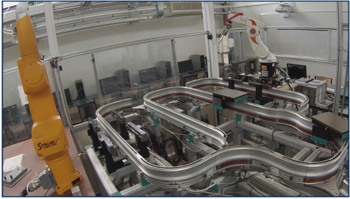
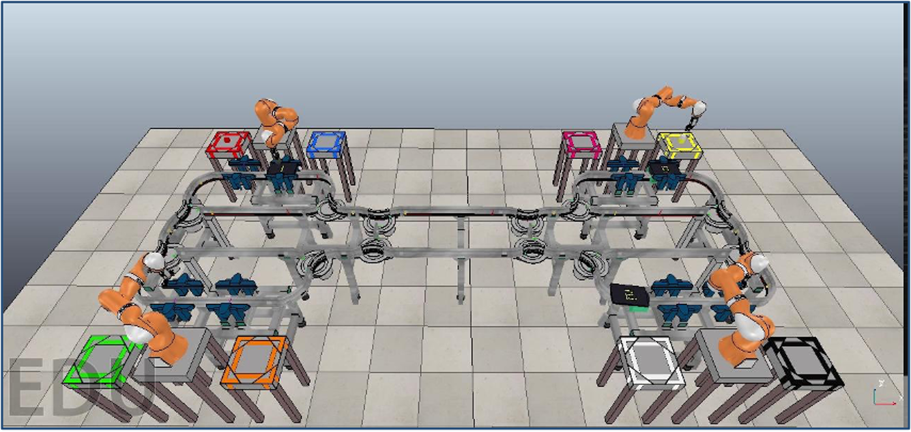
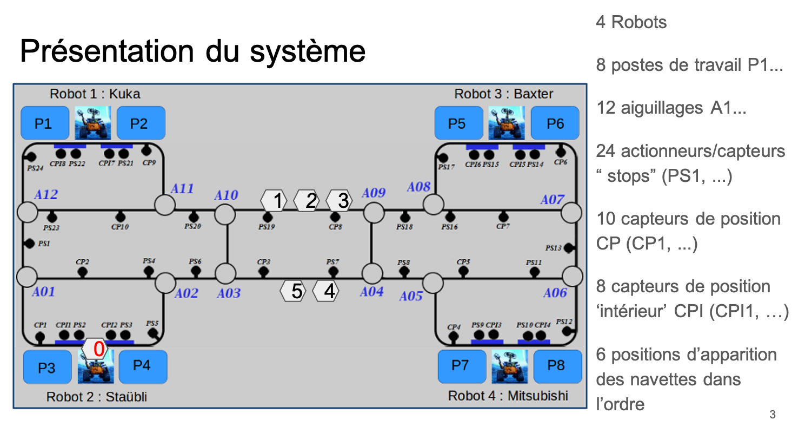

# Shuttles and robots challenge for students  

https://user-images.githubusercontent.com/84821679/198697250-7861b35a-a503-4246-86e2-939076bb784c.mp4

# TER atelier flexible







### Instructions disponibles

|    |    |
| ------------ | ------------ |
|  void **aiguillage.Droite**(num_aiguillage) | void **aiguillage.Gauche**(num_aiguillage)   |
|  bool **capteur.get_PS**(int num_PS)  |  bool **capteur.get_CP**(int num_CP)   |
| bool **capteur.get_CPI**(int num_CPI)   | bool **capteur.get_DG**(int num_DG)   |
|  bool **capteur.get_DD**(int num_DD)  |  void **cmd.Stop_PS**(num_capteur_PS)  |
|  void **cmd.Ouvrir_PS**(num_capteur_PS)  |  void **robot.FaireTache**(ref_poste, duree)  |
| int **robot.TacheFinie**(ref_poste)   |  void **robot.AjouterProduit**(ref_poste, num_produit)  |
|  int **robot.FinDeplacerPiece**(ref_robot)    |  void **robot.Evacuer()**  |
|    |void **robot.DeplacerPiece**(ref_robot, num_position_A, num_position_B)  |

### Guide d'installation

Petit guide pour installer le projet sur votre machine: soit une machine Ubuntu 20.04, soit une machine virtuelle 20.04

- 0) Ouvrir un terminal et faire :
```
		sudo apt update
		sudo apt upgrade
```

- 1) Si ROS noetic n'est pas déjà installé, suivre la procédure :
```
		http://wiki.ros.org/noetic/Installation/Ubuntu
```

	- Cette procédure contient les étapes suivantes :
```
sudo sh -c 'echo "deb http://packages.ros.org/ros/ubuntu $(lsb_release -sc) main" > /etc/apt/sources.list.d/ros-latest.list'
sudo apt update
```

	- Cette procédure a créé le message d'erreur suivant disant que la clé publique associée à ROS n'était pas disponible.
	** Err:5 http://packages.ros.org/ros/ubuntu focal InRelease
	** The following signatures couldn't be verified because the public key is not available: NO_PUBKEY F42ED6FBAB17C654

	- Comme nous faisons confiance à ROS, nous pouvons l'ajouter manuellement
```
		sudo apt-key adv --keyserver keyserver.ubuntu.com --recv-keys F42ED6FBAB17C654
```

	- A présent on peut donc refaire:
```
sudo apt update
```

	- qui ne donne plus de message d'erreur, ce qui permet de faire :
```
sudo apt install ros-noetic-desktop-full
```

- 2) Ajouter les packages ROS suivants :
```
		sudo apt-get install ros-noetic-moveit
		sudo apt-get install ros-noetic-industrial-*
```

- 3) Installer la librairie modbus :
```
		sudo apt-get install libmodbus-dev
		sudo pip install pyModbusTCP
```

- 4) Pour installer catmux :
```
		sudo apt-get install tmux
		pip3 install --user catmux
```

- 5) Une fois l'installation terminée, redémarrer :
```
		sudo reboot
```

- 6) Vérifier si git est installée en tapant `git`. S'il n'est pas installé, suivre la procédure suivante, car nous en auront besoin pour récupérer le répertoire du TER :
```
		sudo apt-get install git
```

- 7) Vérifier si xterm  est installé en tapant `xterm`. S'il n'est pas installé, alors le faire car notre launcher de ROS (roslaunch) en aura besoin:
```
		sudo apt-get install xterm
```

- 8) A présent, se placer dans le répertoire où nous voudrons le répertoire du TER:
```
		cd XXX/XXX
```

- 9) Cloner le répertoire de travail sur le bureau :
```
		git clone https://github.com/ngueveu/shuttles-and-robots-challenge-for-students.git
```

ou, si vous voulez cloner mais uniquement en "lecture seule" et sans jamais pouvoir interagir avec le répertoire sur le serveur:
```
		git clone https://github.com/ngueveu/shuttles-and-robots-challenge-for-students.git
```

Puis vous pouvez renommer le répertoire TERcelluleflexible
```
		mv shuttles-and-robots-challenge-for-students TERcelluleflexible
```

Notez que si le projet existait déjà mais que vous décidez de le mettre à jour (ce qui écrasera en grande partie la précédente version), alors se placer à la racine du répertoire TERcelluleflexible du git et exécuter:

          git fetch --all
          git reset --hard origin/master

Dans le dossier TERcelluleflexible il devrait y avoir deux dossier: celluleflexible et etu (si ce dossier n'existe pas, se placer à la racine du dossier TERcelluleflexible et exécuter l'instruction suivante : cp celluleflexible/forTER/etu_init etu).

- 11) Vérifier si Doxygen est installé. Si ce n'est pas le cas, si vous avez les droits administrateurs, faire :
```
		sudo apt-get install doxygen
		sudo apt-get install doxygen-gui
		sudo apt-get install doxygen-doc
```
Sinon, si vous n'avez pas les droits administrateurs, alors récupérez un exécutable de Doxygen (https://doc.ubuntu-fr.org/doxygen) et mettez-le dans le dossier etu

- 12) Exécuter le code de TER :
```
		cd tercelluleflexible
		source /opt/ros/noetic/setup.bash
		cd celluleflexible/ros_ws
		catkin_make
		source devel/setup.bash
		cd ../../etu
```

- 13) Tester si tout a bien fonctionné en testant le tutoriel :
```
		cd ../../etu/
		cp exemple/Tuto_Basique.main_commande.cpp .
		./script0_Compile.sh Tuto_Basique dataR_1_1_n0
		./script1_Run.sh
		./script2_GetSimuOutput.sh Tuto_Basique dataR_1_1_n0
		./script3_Validation.sh Tuto_Basique dataR_1_1_n0
		./script4_Documentation.sh Tuto_Basique
```

- 14) A présent vous êtes prêt à commencer le TER, se référer au README.txt dans le dossier etu pour la suite.


A noter que si la compilation ne se lance pas, allez dans le dossier ros_ws, supprimez les dossiers build et devez. Puis allez dans le dossier ros_ws et supprimez le fichier "CMakeLists".
Quelques erreurs lors de l'installation la première fois s'assurer d'avoir fait dans le terminal: source /opt/ros/melodic/setup.bash s'assurer que xterm est installé: `sudo apt install xterm`
recupérer coppelia sim ubuntu20 et écraser/fusionner avec le dossier actuel depuis le dossier ros_ws faire `source devel/setup.bash`
